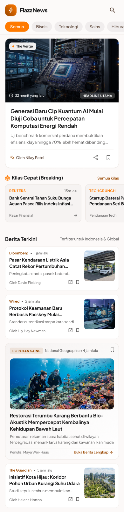

# ⚡ Flazz News

Aplikasi portal berita modern dan responsif yang dibangun menggunakan **Flutter** dan **GetX** Pattern. Aplikasi ini mengintegrasikan data berita terkini secara real-time dari **NewsAPI.org** dengan desain antarmuka (*UI/UX*) bergaya *editorial magazine* yang bersih, kontemporer, dan elegan.

---

## 📱 Tangkapan Layar (UI Showcase)

Berikut adalah tampilan antarmuka utama dari aplikasi Flazz News:

| Halaman Beranda (Home) | Detail Berita (Article Detail) |
| :---: | :---: |
|  |  |
| *Headline berita utama, kategori filter, dan daftar artikel* | *Tampilan baca artikel penuh, metadata sumber, dan aksi share* |

---

## ✨ Fitur Utama

- **📰 Top Headlines & Breaking News**: Menyajikan berita terkini dan terpopuler dengan layout kartu berita unggulan (*featured hero banner*).
- **🏷️ Filter Kategori Berita**: Filter berita berdasarkan berbagai topik seperti *Business*, *Technology*, *Sports*, *Entertainment*, *Health*, dan *Science*.
- **🔍 Pencarian Berita**: Mencari artikel atau topik berita spesifik secara instan.
- **🔄 Pull to Refresh**: Tarik ke bawah untuk memperbarui daftar berita dengan data paling baru.
- **📄 Detail Berita Lengkap**: Tampilan baca yang nyaman dengan tipografi modern, metadata penerbit, tanggal rilis, dan ringkasan isi.
- **🌐 Baca Selengkapnya di Web**: Membuka tautan artikel asli langsung di browser perangkat via `url_launcher`.
- **🔗 Bagikan Berita**: Berbagi tautan dan judul artikel ke media sosial atau aplikasi perpesanan lain via `share_plus`.
- **⚡ Shimmer Loading Effect**: Pengalaman visual loading yang halus dan modern saat mengambil data jaringan.

---

## 🛠️ Arsitektur & Teknologi

Proyek ini dibangun dengan pola arsitektur **GetX Clean Architecture / MVC Pattern**:

- **Framework**: [Flutter](https://flutter.dev/) (Dart SDK ^3.12.2)
- **State Management & Navigasi**: [GetX](https://pub.dev/packages/get)
- **Network Client**: [http](https://pub.dev/packages/http)
- **API Sumber Berita**: [NewsAPI.org](https://newsapi.org/)
- **Penyimpanan Konfigurasi**: [flutter_dotenv](https://pub.dev/packages/flutter_dotenv)
- **Image Caching**: [cached_network_image](https://pub.dev/packages/cached_network_image)
- **Font & Tipografi**: [google_fonts](https://pub.dev/packages/google_fonts) (Plus Jakarta Sans)
- **Vector Icons & SVG**: [flutter_svg](https://pub.dev/packages/flutter_svg) & `cupertino_icons`

---

## 📂 Struktur Direktori Proyek

```text
flazz_news/
├── assets/                  # Asset grafis, logo, icon, tangkapan layar UI, dan file konfigurasi .env
│   ├── Detail Berita_refrence.png
│   ├── Home_refrence.png
│   ├── Logo.svg
│   └── .env.example
├── lib/
│   ├── bindings/            # Dependency injection GetX (AppBindings, HomeBinding)
│   ├── controllers/         # State controller (NewsController)
│   ├── models/              # Model data (NewsArticle, NewsResponse)
│   ├── routes/              # Konfigurasi rute navigasi (AppPages, AppRoutes)
│   ├── services/            # Service pemanggilan API (NewsService)
│   ├── utils/               # Konstanta dan tema warna (AppColors, Constants)
│   ├── views/               # Tampilan UI/Layar (SplashView, HomeView, NewsDetailView)
│   ├── widgets/             # Komponen UI modular (NewsCard, CategoryChip, LoadingShimmer)
│   └── main.dart            # Titik masuk utama aplikasi (main entry point)
└── pubspec.yaml             # Dependensi dan metadata proyek Flutter
```

---

## 🚀 Memulai (Getting Started)

### Prasyarat
- Flutter SDK (versi `>= 3.12.2`)
- Editor (Android Studio atau Visual Studio Code dengan ekstensi Flutter/Dart)
- API Key dari [NewsAPI.org](https://newsapi.org/register)

### Langkah Instalasi

1. **Clone repositori ini**:
   ```bash
   git clone https://github.com/FaishalFaiz/FlazzNews-NewsPortalApp.git
   cd flazz_news
   ```

2. **Pasang dependensi Flutter**:
   ```bash
   flutter pub get
   ```

3. **Konfigurasi Environment Variable (`.env`)**:
   Salin file `assets/.env.example` menjadi `.env` di dalam folder root atau sesuaikan lokasi file `.env` proyek:
   ```bash
   cp assets/.env.example .env
   ```
   Buka file `.env` dan masukkan API Key NewsAPI Anda:
   ```env
   API_KEY=masukkan_api_key_newsapi_anda_disini
   ```

4. **Jalankan Aplikasi**:
   Pastikan emulator atau perangkat fisik Android/iOS telah terhubung, lalu jalankan:
   ```bash
   flutter run
   ```

---

## 📄 Lisensi

Proyek ini dibuat untuk keperluan pembelajaran dan portofolio. Bebas dikembangkan dan dimodifikasi untuk kebutuhan belajar.
